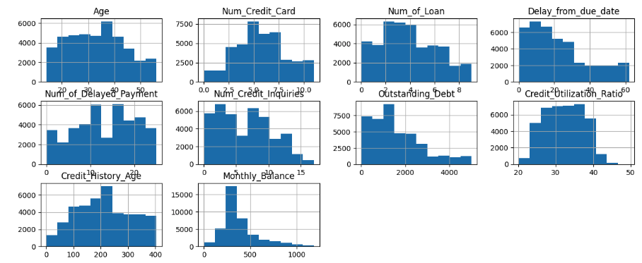
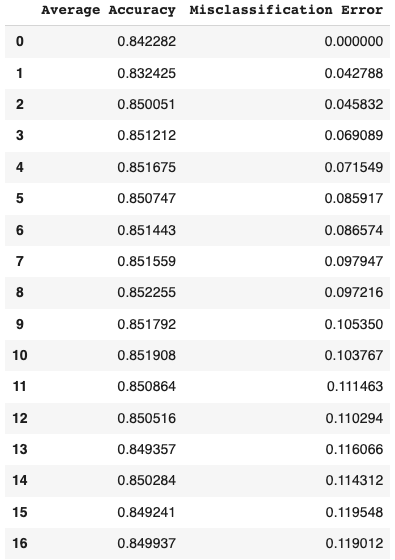
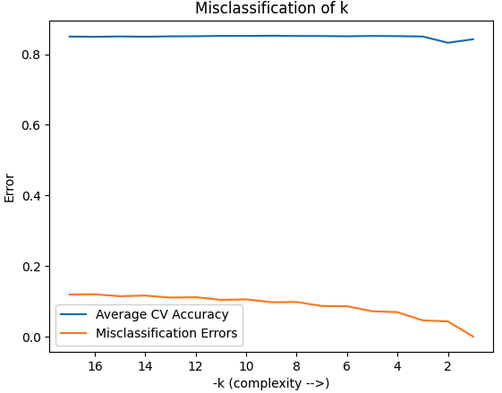
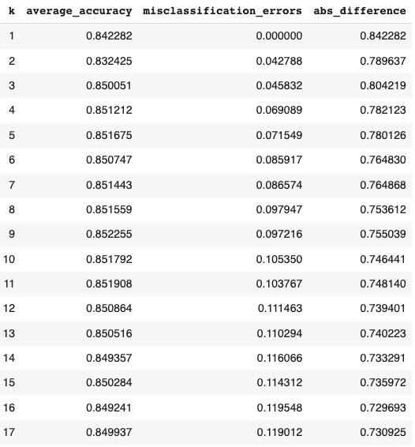
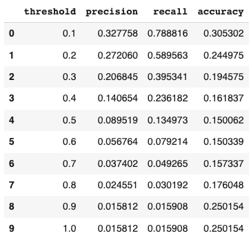
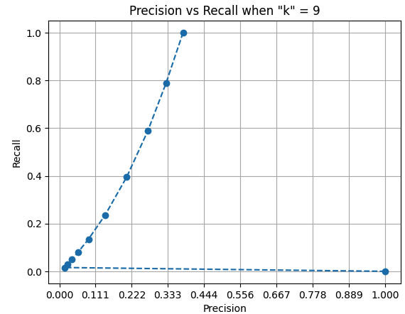
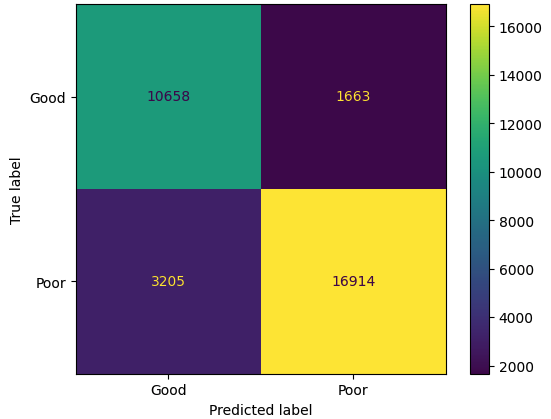

# Credit Score Classification
For this assignment, I use 'Credit Score Classification'. The data contains 100,000 entries and 20 columns. My businesFor this assignment, I use 'Credit Score Classification'. The data contains 100,000 entries and 20 columns. My business interest in this data was to predict credit scores ('Good', 'Bad').

On the first pass, I identified text (string) rows and used the OneHotEncoder to encode them. This failed because one of the columns (Type_of_Loan) contained comma separated strings (eg. "auto loan,credit-builder loan,personal loan,home equity loan"). I therefore dropped this column. I also dropped ID and SSN since these would not be of benefit.

Running a Pipeline with the transformer/encoder, StandardScaler and KNeighborsClassifier in GridSearchCV with 1000 n_neighbors at odd increments with cv=5 (after a LONG time on Google Colab using a TPU) yielded an optimal value of "k" = 1. To me this signified that there are too many features (from the original 20, 17). I then started to plot histograms to identify features with reasonable distributions. I arrived at 10:

I repeated GridSearchCV with scoring set to 'accuracy, with these features and since only 'Credit_Score' was a textural feature (my 'y'), I omitted the transformer. This yielded an optimal "k" value of 9 and the best (accuracy) score of 0.8522554221729044.

I then compared the average accuracy (from GridSearchCV, again, using 'accuracy' as the scoring method) vs. 1 - accuracy_score, for a 'k' range of 1-18:

The interesting observation was the the 'misclassification error' when 'k' = 1 was also 0; as in the first attempt using all of the features. Here we see that the GridSearchCV accuracy remains relatively constant over the 17 'k' values, while the misclassification error increases at a slow rate. The two were plotted, reversing 'k' (-k) to illustrate this:

If we look at the absolute difference between accuracy and misclassification, there is an interesting drop between 'k' = 1 and 2, then rise between k = 2 and 3, followed by a very gradual decrease. We see that both values decrease very gradually; aside from the anomaly between k = 1 and 3.

Comparing precision_score, recall_score and accuracy_score using the same pipeline as before, with 'k' = 9 revealed that recall_score (not precision) had the best score of 0.8650271893515137. This was slightly worse than the Credit_Score (accuracy) score from earlier.

Next, I repeated the precision_score, recall_score and accuracy_score tests with thresholds  ranging from 0.1-1.0:

We see that as the threshold increased, precision decreased, recall decreased while accuracy initially decreased and then began to increase past the threshold of 0.9.

Using precision_recall_curve, a plot was made for precision, recall and thresholds comparing the predicted to test 'y' (Credit_Score) data:

What is interesting here is the 'dominance' of Recall over precision. Reading this graph, we see that when recall (the correctly predicted positive observations in relation to all of the observed data) reaches 1.0 around where precision (the accurate positive observations in relation to the total positive observations) is between 0.3 and 0.4. Another way to interpret this, from a business standpoint, is recall would be more desirable to give a good credit score at a higher risk, while accuracy would be the desire to make this distinction/decision with more confidence; perhaps to avoid giving someone a 'risky' loan.

Finally, the confusion matrix produces the following values:

accuracy: 0.8499383477188656
precision: 0.9104807019432631
recall ("sensitivity"): 0.8406978478055569
specificity: 0.8650271893515137

This particular model maintains the best score as 'precision'. As suggested earlier, from a business perspective, it leans towards 'certainty' that the individual in the data set can qualify for a better ('Good') credit score. If this is a bank, this could mean a better interest rate on a mortgage. Perhaps if renting an apartment, a better chance at qualifying for a lease.For this assignment, I use 'Credit Score Classification'. The data contains 100,000 entries and 20 columns. My business interest in this data was to predict credit scores ('Good', 'Bad').

On the first pass, I identified text (string) rows and used the OneHotEncoder to encode them. This failed because one of the columns (Type_of_Loan) contained comma separated strings (eg. "auto loan,credit-builder loan,personal loan,home equity loan"). I therefore dropped this column. I also dropped ID and SSN since these would not be of benefit.

Running a Pipeline with the transformer/encoder, StandardScaler and KNeighborsClassifier in GridSearchCV with 1000 n_neighbors at odd increments with cv=5 (after a LONG time on Google Colab using a TPU) yielded an optimal value of "k" = 1. To me this signified that there are too many features (from the original 20, 17). I then started to plot histograms to identify features with reasonable distributions. I arrived at 10:

I repeated GridSearchCV with scoring set to 'accuracy, with these features and since only 'Credit_Score' was a textural feature (my 'y'), I omitted the transformer. This yielded an optimal "k" value of 9 and the best (accuracy) score of 0.8522554221729044.

I then compared the average accuracy (from GridSearchCV, again, using 'accuracy' as the scoring method) vs. 1 - accuracy_score, for a 'k' range of 1-18:

The interesting observation was the the 'misclassification error' when 'k' = 1 was also 0; as in the first attempt using all of the features. Here we see that the GridSearchCV accuracy remains relatively constant over the 17 'k' values, while the misclassification error increases at a slow rate. The two were plotted, reversing 'k' (-k) to illustrate this:

If we look at the absolute difference between accuracy and misclassification, there is an interesting drop between 'k' = 1 and 2, then rise between k = 2 and 3, followed by a very gradual decrease. We see that both values decrease very gradually; aside from the anomaly between k = 1 and 3.

Comparing precision_score, recall_score and accuracy_score using the same pipeline as before, with 'k' = 9 revealed that recall_score (not precision) had the best score of 0.8650271893515137. This was slightly worse than the Credit_Score (accuracy) score from earlier.

Next, I repeated the precision_score, recall_score and accuracy_score tests with thresholds  ranging from 0.1-1.0:

We see that as the threshold increased, precision decreased, recall decreased while accuracy initially decreased and then began to increase past the threshold of 0.9.

Using precision_recall_curve, a plot was made for precision, recall and thresholds comparing the predicted to test 'y' (Credit_Score) data:

What is interesting here is the 'dominance' of Recall over precision. Reading this graph, we see that when recall (the correctly predicted positive observations in relation to all of the observed data) reaches 1.0 around where precision (the accurate positive observations in relation to the total positive observations) is between 0.3 and 0.4. Another way to interpret this, from a business standpoint, is recall would be more desirable to give a good credit score at a higher risk, while accuracy would be the desire to make this distinction/decision with more confidence; perhaps to avoid giving someone a 'risky' loan.

Finally, the confusion matrix produces the following values:

accuracy: 0.8499383477188656
precision: 0.9104807019432631
recall ("sensitivity"): 0.8406978478055569
specificity: 0.8650271893515137

This particular model maintains the best score as 'precision'. As suggested earlier, from a business perspective, it leans towards 'certainty' that the individual in the data set can qualify for a better ('Good') credit score. If this is a bank, this could mean a better interest rate on a mortgage. Perhaps if renting an apartment, a better chance at qualifying for a lease.For this assignment, I use 'Credit Score Classification'. The data contains 100,000 entries and 20 columns. My business interest in this data was to predict credit scores ('Good', 'Bad').

On the first pass, I identified text (string) rows and used the OneHotEncoder to encode them. This failed because one of the columns (Type_of_Loan) contained comma separated strings (eg. "auto loan,credit-builder loan,personal loan,home equity loan"). I therefore dropped this column. I also dropped ID and SSN since these would not be of benefit.

Running a Pipeline with the transformer/encoder, StandardScaler and KNeighborsClassifier in GridSearchCV with 1000 n_neighbors at odd increments with cv=5 (after a LONG time on Google Colab using a TPU) yielded an optimal value of "k" = 1. To me this signified that there are too many features (from the original 20, 17). I then started to plot histograms to identify features with reasonable distributions. I arrived at 10:

I repeated GridSearchCV with scoring set to 'accuracy, with these features and since only 'Credit_Score' was a textural feature (my 'y'), I omitted the transformer. This yielded an optimal "k" value of 9 and the best (accuracy) score of 0.8522554221729044.

I then compared the average accuracy (from GridSearchCV, again, using 'accuracy' as the scoring method) vs. 1 - accuracy_score, for a 'k' range of 1-18:

The interesting observation was the the 'misclassification error' when 'k' = 1 was also 0; as in the first attempt using all of the features. Here we see that the GridSearchCV accuracy remains relatively constant over the 17 'k' values, while the misclassification error increases at a slow rate. The two were plotted, reversing 'k' (-k) to illustrate this:

If we look at the absolute difference between accuracy and misclassification, there is an interesting drop between 'k' = 1 and 2, then rise between k = 2 and 3, followed by a very gradual decrease. We see that both values decrease very gradually; aside from the anomaly between k = 1 and 3.

Comparing precision_score, recall_score and accuracy_score using the same pipeline as before, with 'k' = 9 revealed that recall_score (not precision) had the best score of 0.8650271893515137. This was slightly worse than the Credit_Score (accuracy) score from earlier.

Next, I repeated the precision_score, recall_score and accuracy_score tests with thresholds  ranging from 0.1-1.0:

We see that as the threshold increased, precision decreased, recall decreased while accuracy initially decreased and then began to increase past the threshold of 0.9.

Using precision_recall_curve, a plot was made for precision, recall and thresholds comparing the predicted to test 'y' (Credit_Score) data:

What is interesting here is the 'dominance' of Recall over precision. Reading this graph, we see that when recall (the correctly predicted positive observations in relation to all of the observed data) reaches 1.0 around where precision (the accurate positive observations in relation to the total positive observations) is between 0.3 and 0.4. Another way to interpret this, from a business standpoint, is recall would be more desirable to give a good credit score at a higher risk, while accuracy would be the desire to make this distinction/decision with more confidence; perhaps to avoid giving someone a 'risky' loan.

Finally, the confusion matrix produces the following values:

accuracy: 0.8499383477188656
precision: 0.9104807019432631
recall ("sensitivity"): 0.8406978478055569
specificity: 0.8650271893515137

This particular model maintains the best score as 'precision'. As suggested earlier, from a business perspective, it leans towards 'certainty' that the individual in the data set can qualify for a better ('Good') credit score. If this is a bank, this could mean a better interest rate on a mortgage. Perhaps if renting an apartment, a better chance at qualifying for a lease.For this assignment, I use 'Credit Score Classification'. The data contains 100,000 entries and 20 columns. My business interest in this data was to predict credit scores ('Good', 'Bad').

On the first pass, I identified text (string) rows and used the OneHotEncoder to encode them. This failed because one of the columns (Type_of_Loan) contained comma separated strings (eg. "auto loan,credit-builder loan,personal loan,home equity loan"). I therefore dropped this column. I also dropped ID and SSN since these would not be of benefit.

Running a Pipeline with the transformer/encoder, StandardScaler and KNeighborsClassifier in GridSearchCV with 1000 n_neighbors at odd increments with cv=5 (after a LONG time on Google Colab using a TPU) yielded an optimal value of "k" = 1. To me this signified that there are too many features (from the original 20, 17). I then started to plot histograms to identify features with reasonable distributions. I arrived at 10:

I repeated GridSearchCV with scoring set to 'accuracy, with these features and since only 'Credit_Score' was a textural feature (my 'y'), I omitted the transformer. This yielded an optimal "k" value of 9 and the best (accuracy) score of 0.8522554221729044.

I then compared the average accuracy (from GridSearchCV, again, using 'accuracy' as the scoring method) vs. 1 - accuracy_score, for a 'k' range of 1-18:

The interesting observation was the the 'misclassification error' when 'k' = 1 was also 0; as in the first attempt using all of the features. Here we see that the GridSearchCV accuracy remains relatively constant over the 17 'k' values, while the misclassification error increases at a slow rate. The two were plotted, reversing 'k' (-k) to illustrate this:

If we look at the absolute difference between accuracy and misclassification, there is an interesting drop between 'k' = 1 and 2, then rise between k = 2 and 3, followed by a very gradual decrease. We see that both values decrease very gradually; aside from the anomaly between k = 1 and 3.

Comparing precision_score, recall_score and accuracy_score using the same pipeline as before, with 'k' = 9 revealed that recall_score (not precision) had the best score of 0.8650271893515137. This was slightly worse than the Credit_Score (accuracy) score from earlier.

Next, I repeated the precision_score, recall_score and accuracy_score tests with thresholds  ranging from 0.1-1.0:

We see that as the threshold increased, precision decreased, recall decreased while accuracy initially decreased and then began to increase past the threshold of 0.9.

Using precision_recall_curve, a plot was made for precision, recall and thresholds comparing the predicted to test 'y' (Credit_Score) data:

What is interesting here is the 'dominance' of Recall over precision. Reading this graph, we see that when recall (the correctly predicted positive observations in relation to all of the observed data) reaches 1.0 around where precision (the accurate positive observations in relation to the total positive observations) is between 0.3 and 0.4. Another way to interpret this, from a business standpoint, is recall would be more desirable to give a good credit score at a higher risk, while accuracy would be the desire to make this distinction/decision with more confidence; perhaps to avoid giving someone a 'risky' loan.

Finally, the confusion matrix produces the following values:

accuracy: 0.8499383477188656
precision: 0.9104807019432631
recall ("sensitivity"): 0.8406978478055569
specificity: 0.8650271893515137

This particular model maintains the best score as 'precision'. As suggested earlier, from a business perspective, it leans towards 'certainty' that the individual in the data set can qualify for a better ('Good') credit score. If this is a bank, this could mean a better interest rate on a mortgage. Perhaps if renting an apartment, a better chance at qualifying for a lease.s interest in this data was to predict credit scores ('Good', 'Bad').For this assignment, I use 'Credit Score Classification'. The data contains 100,000 entries and 20 columns. My business interest in this data was to predict credit scores ('Good', 'Bad').

On the first pass, I identified text (string) rows and used the OneHotEncoder to encode them. This failed because one of the columns (Type_of_Loan) contained comma separated strings (eg. "auto loan,credit-builder loan,personal loan,home equity loan"). I therefore dropped this column. I also dropped ID and SSN since these would not be of benefit.

Running a Pipeline with the transformer/encoder, StandardScaler and KNeighborsClassifier in GridSearchCV with 1000 n_neighbors at odd increments with cv=5 (after a LONG time on Google Colab using a TPU) yielded an optimal value of "k" = 1. To me this signified that there are too many features (from the original 20, 17). I then started to plot histograms to identify features with reasonable distributions. I arrived at 10:

I repeated GridSearchCV with scoring set to 'accuracy, with these features and since only 'Credit_Score' was a textural feature (my 'y'), I omitted the transformer. This yielded an optimal "k" value of 9 and the best (accuracy) score of 0.8522554221729044.

I then compared the average accuracy (from GridSearchCV, again, using 'accuracy' as the scoring method) vs. 1 - accuracy_score, for a 'k' range of 1-18:

The interesting observation was the the 'misclassification error' when 'k' = 1 was also 0; as in the first attempt using all of the features. Here we see that the GridSearchCV accuracy remains relatively constant over the 17 'k' values, while the misclassification error increases at a slow rate. The two were plotted, reversing 'k' (-k) to illustrate this:

If we look at the absolute difference between accuracy and misclassification, there is an interesting drop between 'k' = 1 and 2, then rise between k = 2 and 3, followed by a very gradual decrease. We see that both values decrease very gradually; aside from the anomaly between k = 1 and 3.

Comparing precision_score, recall_score and accuracy_score using the same pipeline as before, with 'k' = 9 revealed that recall_score (not precision) had the best score of 0.8650271893515137. This was slightly worse than the Credit_Score (accuracy) score from earlier.

Next, I repeated the precision_score, recall_score and accuracy_score tests with thresholds  ranging from 0.1-1.0:

We see that as the threshold increased, precision decreased, recall decreased while accuracy initially decreased and then began to increase past the threshold of 0.9.

Using precision_recall_curve, a plot was made for precision, recall and thresholds comparing the predicted to test 'y' (Credit_Score) data:

What is interesting here is the 'dominance' of Recall over precision. Reading this graph, we see that when recall (the correctly predicted positive observations in relation to all of the observed data) reaches 1.0 around where precision (the accurate positive observations in relation to the total positive observations) is between 0.3 and 0.4. Another way to interpret this, from a business standpoint, is recall would be more desirable to give a good credit score at a higher risk, while accuracy would be the desire to make this distinction/decision with more confidence; perhaps to avoid giving someone a 'risky' loan.

Finally, the confusion matrix produces the following values:

accuracy: 0.8499383477188656
precision: 0.9104807019432631
recall ("sensitivity"): 0.8406978478055569
specificity: 0.8650271893515137

This particular model maintains the best score as 'precision'. As suggested earlier, from a business perspective, it leans towards 'certainty' that the individual in the data set can qualify for a better ('Good') credit score. If this is a bank, this could mean a better interest rate on a mortgage. Perhaps if renting an apartment, a better chance at qualifying for a lease.For this assignment, I use 'Credit Score Classification'. The data contains 100,000 entries and 20 columns. My business interest in this data was to predict credit scores ('Good', 'Bad').

On the first pass, I identified text (string) rows and used the OneHotEncoder to encode them. This failed because one of the columns (Type_of_Loan) contained comma separated strings (eg. "auto loan,credit-builder loan,personal loan,home equity loan"). I therefore dropped this column. I also dropped ID and SSN since these would not be of benefit.

Running a Pipeline with the transformer/encoder, StandardScaler and KNeighborsClassifier in GridSearchCV with 1000 n_neighbors at odd increments with cv=5 (after a LONG time on Google Colab using a TPU) yielded an optimal value of "k" = 1. To me this signified that there are too many features (from the original 20, 17). I then started to plot histograms to identify features with reasonable distributions. I arrived at 10:

I repeated GridSearchCV with scoring set to 'accuracy, with these features and since only 'Credit_Score' was a textural feature (my 'y'), I omitted the transformer. This yielded an optimal "k" value of 9 and the best (accuracy) score of 0.8522554221729044.

I then compared the average accuracy (from GridSearchCV, again, using 'accuracy' as the scoring method) vs. 1 - accuracy_score, for a 'k' range of 1-18:

The interesting observation was the the 'misclassification error' when 'k' = 1 was also 0; as in the first attempt using all of the features. Here we see that the GridSearchCV accuracy remains relatively constant over the 17 'k' values, while the misclassification error increases at a slow rate. The two were plotted, reversing 'k' (-k) to illustrate this:

If we look at the absolute difference between accuracy and misclassification, there is an interesting drop between 'k' = 1 and 2, then rise between k = 2 and 3, followed by a very gradual decrease. We see that both values decrease very gradually; aside from the anomaly between k = 1 and 3.

Comparing precision_score, recall_score and accuracy_score using the same pipeline as before, with 'k' = 9 revealed that recall_score (not precision) had the best score of 0.8650271893515137. This was slightly worse than the Credit_Score (accuracy) score from earlier.

Next, I repeated the precision_score, recall_score and accuracy_score tests with thresholds  ranging from 0.1-1.0:

We see that as the threshold increased, precision decreased, recall decreased while accuracy initially decreased and then began to increase past the threshold of 0.9.

Using precision_recall_curve, a plot was made for precision, recall and thresholds comparing the predicted to test 'y' (Credit_Score) data:

What is interesting here is the 'dominance' of Recall over precision. Reading this graph, we see that when recall (the correctly predicted positive observations in relation to all of the observed data) reaches 1.0 around where precision (the accurate positive observations in relation to the total positive observations) is between 0.3 and 0.4. Another way to interpret this, from a business standpoint, is recall would be more desirable to give a good credit score at a higher risk, while accuracy would be the desire to make this distinction/decision with more confidence; perhaps to avoid giving someone a 'risky' loan.

Finally, the confusion matrix produces the following values:

accuracy: 0.8499383477188656
precision: 0.9104807019432631
recall ("sensitivity"): 0.8406978478055569
specificity: 0.8650271893515137

This particular model maintains the best score as 'precision'. As suggested earlier, from a business perspective, it leans towards 'certainty' that the individual in the data set can qualify for a better ('Good') credit score. If this is a bank, this could mean a better interest rate on a mortgage. Perhaps if renting an apartment, a better chance at qualifying for a lease.For this assignment, I use 'Credit Score Classification'. The data contains 100,000 entries and 20 columns. My business interest in this data was to predict credit scores ('Good', 'Bad').

On the first pass, I identified text (string) rows and used the OneHotEncoder to encode them. This failed because one of the columns (Type_of_Loan) contained comma separated strings (eg. "auto loan,credit-builder loan,personal loan,home equity loan"). I therefore dropped this column. I also dropped ID and SSN since these would not be of benefit.

Running a Pipeline with the transformer/encoder, StandardScaler and KNeighborsClassifier in GridSearchCV with 1000 n_neighbors at odd increments with cv=5 (after a LONG time on Google Colab using a TPU) yielded an optimal value of "k" = 1. To me this signified that there are too many features (from the original 20, 17). I then started to plot histograms to identify features with reasonable distributions. I arrived at 10:

I repeated GridSearchCV with scoring set to 'accuracy, with these features and since only 'Credit_Score' was a textural feature (my 'y'), I omitted the transformer. This yielded an optimal "k" value of 9 and the best (accuracy) score of 0.8522554221729044.

I then compared the average accuracy (from GridSearchCV, again, using 'accuracy' as the scoring method) vs. 1 - accuracy_score, for a 'k' range of 1-18:

The interesting observation was the the 'misclassification error' when 'k' = 1 was also 0; as in the first attempt using all of the features. Here we see that the GridSearchCV accuracy remains relatively constant over the 17 'k' values, while the misclassification error increases at a slow rate. The two were plotted, reversing 'k' (-k) to illustrate this:

If we look at the absolute difference between accuracy and misclassification, there is an interesting drop between 'k' = 1 and 2, then rise between k = 2 and 3, followed by a very gradual decrease. We see that both values decrease very gradually; aside from the anomaly between k = 1 and 3.

Comparing precision_score, recall_score and accuracy_score using the same pipeline as before, with 'k' = 9 revealed that recall_score (not precision) had the best score of 0.8650271893515137. This was slightly worse than the Credit_Score (accuracy) score from earlier.

Next, I repeated the precision_score, recall_score and accuracy_score tests with thresholds  ranging from 0.1-1.0:

We see that as the threshold increased, precision decreased, recall decreased while accuracy initially decreased and then began to increase past the threshold of 0.9.

Using precision_recall_curve, a plot was made for precision, recall and thresholds comparing the predicted to test 'y' (Credit_Score) data:

What is interesting here is the 'dominance' of Recall over precision. Reading this graph, we see that when recall (the correctly predicted positive observations in relation to all of the observed data) reaches 1.0 around where precision (the accurate positive observations in relation to the total positive observations) is between 0.3 and 0.4. Another way to interpret this, from a business standpoint, is recall would be more desirable to give a good credit score at a higher risk, while accuracy would be the desire to make this distinction/decision with more confidence; perhaps to avoid giving someone a 'risky' loan.

Finally, the confusion matrix produces the following values:

accuracy: 0.8499383477188656
precision: 0.9104807019432631
recall ("sensitivity"): 0.8406978478055569
specificity: 0.8650271893515137

This particular model maintains the best score as 'precision'. As suggested earlier, from a business perspective, it leans towards 'certainty' that the individual in the data set can qualify for a better ('Good') credit score. If this is a bank, this could mean a better interest rate on a mortgage. Perhaps if renting an apartment, a better chance at qualifying for a lease.For this assignment, I use 'Credit Score Classification'. The data contains 100,000 entries and 20 columns. My business interest in this data was to predict credit scores ('Good', 'Bad').

On the first pass, I identified text (string) rows and used the OneHotEncoder to encode them. This failed because one of the columns (Type_of_Loan) contained comma separated strings (eg. "auto loan,credit-builder loan,personal loan,home equity loan"). I therefore dropped this column. I also dropped ID and SSN since these would not be of benefit.

Running a Pipeline with the transformer/encoder, StandardScaler and KNeighborsClassifier in GridSearchCV with 1000 n_neighbors at odd increments with cv=5 (after a LONG time on Google Colab using a TPU) yielded an optimal value of "k" = 1. To me this signified that there are too many features (from the original 20, 17). I then started to plot histograms to identify features with reasonable distributions. I arrived at 10:

I repeated GridSearchCV with scoring set to 'accuracy, with these features and since only 'Credit_Score' was a textural feature (my 'y'), I omitted the transformer. This yielded an optimal "k" value of 9 and the best (accuracy) score of 0.8522554221729044.

I then compared the average accuracy (from GridSearchCV, again, using 'accuracy' as the scoring method) vs. 1 - accuracy_score, for a 'k' range of 1-18:

The interesting observation was the the 'misclassification error' when 'k' = 1 was also 0; as in the first attempt using all of the features. Here we see that the GridSearchCV accuracy remains relatively constant over the 17 'k' values, while the misclassification error increases at a slow rate. The two were plotted, reversing 'k' (-k) to illustrate this:

If we look at the absolute difference between accuracy and misclassification, there is an interesting drop between 'k' = 1 and 2, then rise between k = 2 and 3, followed by a very gradual decrease. We see that both values decrease very gradually; aside from the anomaly between k = 1 and 3.

Comparing precision_score, recall_score and accuracy_score using the same pipeline as before, with 'k' = 9 revealed that recall_score (not precision) had the best score of 0.8650271893515137. This was slightly worse than the Credit_Score (accuracy) score from earlier.

Next, I repeated the precision_score, recall_score and accuracy_score tests with thresholds  ranging from 0.1-1.0:

We see that as the threshold increased, precision decreased, recall decreased while accuracy initially decreased and then began to increase past the threshold of 0.9.

Using precision_recall_curve, a plot was made for precision, recall and thresholds comparing the predicted to test 'y' (Credit_Score) data:

What is interesting here is the 'dominance' of Recall over precision. Reading this graph, we see that when recall (the correctly predicted positive observations in relation to all of the observed data) reaches 1.0 around where precision (the accurate positive observations in relation to the total positive observations) is between 0.3 and 0.4. Another way to interpret this, from a business standpoint, is recall would be more desirable to give a good credit score at a higher risk, while accuracy would be the desire to make this distinction/decision with more confidence; perhaps to avoid giving someone a 'risky' loan.

Finally, the confusion matrix produces the following values:

accuracy: 0.8499383477188656
precision: 0.9104807019432631
recall ("sensitivity"): 0.8406978478055569
specificity: 0.8650271893515137

This particular model maintains the best score as 'precision'. As suggested earlier, from a business perspective, it leans towards 'certainty' that the individual in the data set can qualify for a better ('Good') credit score. If this is a bank, this could mean a better interest rate on a mortgage. Perhaps if renting an apartment, a better chance at qualifying for a lease.For this assignment, I use 'Credit Score Classification'. The data contains 100,000 entries and 20 columns. My business interest in this data was to predict credit scores ('Good', 'Bad').

On the first pass, I identified text (string) rows and used the OneHotEncoder to encode them. This failed because one of the columns (Type_of_Loan) contained comma separated strings (eg. "auto loan,credit-builder loan,personal loan,home equity loan"). I therefore dropped this column. I also dropped ID and SSN since these would not be of benefit.

Running a Pipeline with the transformer/encoder, StandardScaler and KNeighborsClassifier in GridSearchCV with 1000 n_neighbors at odd increments with cv=5 (after a LONG time on Google Colab using a TPU) yielded an optimal value of "k" = 1. To me this signified that there are too many features (from the original 20, 17). I then started to plot histograms to identify features with reasonable distributions. I arrived at 10:

I repeated GridSearchCV with scoring set to 'accuracy, with these features and since only 'Credit_Score' was a textural feature (my 'y'), I omitted the transformer. This yielded an optimal "k" value of 9 and the best (accuracy) score of 0.8522554221729044.

I then compared the average accuracy (from GridSearchCV, again, using 'accuracy' as the scoring method) vs. 1 - accuracy_score, for a 'k' range of 1-18:

The interesting observation was the the 'misclassification error' when 'k' = 1 was also 0; as in the first attempt using all of the features. Here we see that the GridSearchCV accuracy remains relatively constant over the 17 'k' values, while the misclassification error increases at a slow rate. The two were plotted, reversing 'k' (-k) to illustrate this:

If we look at the absolute difference between accuracy and misclassification, there is an interesting drop between 'k' = 1 and 2, then rise between k = 2 and 3, followed by a very gradual decrease. We see that both values decrease very gradually; aside from the anomaly between k = 1 and 3.

Comparing precision_score, recall_score and accuracy_score using the same pipeline as before, with 'k' = 9 revealed that recall_score (not precision) had the best score of 0.8650271893515137. This was slightly worse than the Credit_Score (accuracy) score from earlier.

Next, I repeated the precision_score, recall_score and accuracy_score tests with thresholds  ranging from 0.1-1.0:

We see that as the threshold increased, precision decreased, recall decreased while accuracy initially decreased and then began to increase past the threshold of 0.9.

Using precision_recall_curve, a plot was made for precision, recall and thresholds comparing the predicted to test 'y' (Credit_Score) data:

What is interesting here is the 'dominance' of Recall over precision. Reading this graph, we see that when recall (the correctly predicted positive observations in relation to all of the observed data) reaches 1.0 around where precision (the accurate positive observations in relation to the total positive observations) is between 0.3 and 0.4. Another way to interpret this, from a business standpoint, is recall would be more desirable to give a good credit score at a higher risk, while accuracy would be the desire to make this distinction/decision with more confidence; perhaps to avoid giving someone a 'risky' loan.

Finally, the confusion matrix produces the following values:

accuracy: 0.8499383477188656
precision: 0.9104807019432631
recall ("sensitivity"): 0.8406978478055569
specificity: 0.8650271893515137

This particular model maintains the best score as 'precision'. As suggested earlier, from a business perspective, it leans towards 'certainty' that the individual in the data set can qualify for a better ('Good') credit score. If this is a bank, this could mean a better interest rate on a mortgage. Perhaps if renting an apartment, a better chance at qualifying for a lease.For this assignment, I use 'Credit Score Classification'. The data contains 100,000 entries and 20 columns. My business interest in this data was to predict credit scores ('Good', 'Bad').

